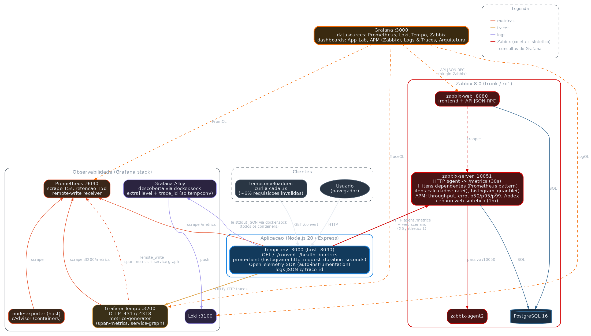

# Observability Lab — Zabbix 8 + Grafana stack

Laboratório local (Docker Compose) que monitora uma aplicação Node.js de ponta a ponta,
combinando **Zabbix 8.0** com a stack **Grafana** (Prometheus, Loki, Tempo, Alloy).

O foco é **APM dentro do Zabbix**: throughput, taxa de erro, latência p50/p95/p99 e Apdex
calculados no próprio Zabbix a partir do histograma Prometheus da aplicação, com alertas,
monitoramento sintético, dashboard e mapa de arquitetura — e o mesmo dado visualizado no
Grafana, com drill-down para traces e logs.

> ⚠️ **Somente para laboratório.** As imagens do Zabbix usam a tag `alpine-trunk`
> (pré-release do 8.0) e podem quebrar entre atualizações. Não use em produção.

---

## Arquitetura



| Sinal | Caminho |
|---|---|
| **Métricas** | app `/metrics` (prom-client) → Prometheus (scrape 15s) · node-exporter e cAdvisor → Prometheus · Tempo → Prometheus (span-metrics via remote_write) |
| **Traces** | app (OpenTelemetry SDK) → Tempo via OTLP/HTTP |
| **Logs** | stdout JSON (com `trace_id`) → Alloy (via `docker.sock`) → Loki |
| **Zabbix** | item HTTP agent no `/metrics` (30s) + itens dependentes + itens calculados (APM) · cenário web sintético (1 min) |
| **Visualização** | Grafana consulta Prometheus, Tempo, Loki e Zabbix (plugin `alexanderzobnin-zabbix-app`) |

Fonte do diagrama: [`docs/arquitetura.dot`](docs/arquitetura.dot) (o mesmo DOT é exibido no Grafana pelo plugin Graphviz).

---

## Pré-requisitos

- Docker + Docker Compose v2
- `bash`, `curl` e `jq` (para o script de setup do Zabbix)
- Portas livres no host: `3000 3100 3200 4317 4318 8080 8090 8443 9090 9100 10050 10051 12345`

## Subindo o laboratório

```bash
# 1. credenciais locais (o .env não é versionado) — edite as senhas
cp .env.example .env

# 2. sobe toda a stack (faz build da app tempconv)
docker compose up -d --build

# 3. aguarde o Zabbix web responder (~1 min no primeiro start, cria o schema do banco)
until curl -sf -o /dev/null http://localhost:8080; do sleep 3; done

# 4. cria no Zabbix o host, os itens de APM, triggers, cenário web, dashboard e mapa
bash zabbix/setup-tempconv.sh
```

Os itens calculados usam `rate()` em janela de 5 min: os valores de APM aparecem após
~2 coletas e estabilizam em ~5 min. O gerador de carga (`tempconv-loadgen`) já começa a
enviar tráfego automaticamente.

O script é **idempotente**: a cada execução ele apaga e recria o host `tempconv-app`,
o dashboard `tempconv APM` e o mapa `tempconv - arquitetura`. Ele lê as credenciais do `.env`;
estas variáveis de ambiente têm precedência:

| Variável | Padrão |
|---|---|
| `ZBX_URL` | `http://localhost:8080/api_jsonrpc.php` |
| `ZBX_USER` / `ZBX_PASS` | `ZABBIX_API_USER` / `ZABBIX_API_PASSWORD` do `.env` |
| `METRICS_URL` | `http://tempconv:3000/metrics` (visto de dentro da rede do compose) |
| `ZBX_HOST_NAME` | `Zabbix server` (host usado no mapa) |
| `GRAFANA_URL` | `http://localhost:3000` (links do mapa) |

## Credenciais

Todas ficam no `.env` (modelo em [`.env.example`](.env.example)), que **não é versionado**:

| Variável | Uso |
|---|---|
| `POSTGRES_USER` / `POSTGRES_PASSWORD` / `POSTGRES_DB` | banco do Zabbix — definido no 1º start; trocar depois exige recriar o volume `pgdata` |
| `GF_ADMIN_USER` / `GF_ADMIN_PASSWORD` | admin do Grafana — aplicado no 1º start |
| `ZABBIX_API_USER` / `ZABBIX_API_PASSWORD` | usuário da API do Zabbix usado pelo datasource do Grafana e pelo script de setup |

O Zabbix sobe com o usuário padrão `Admin` / `zabbix`. Troque a senha na interface
(*User settings → Profile*), atualize `ZABBIX_API_PASSWORD` no `.env` e rode
`docker compose up -d grafana` para o datasource usar a nova senha.

## Acessos

| Serviço | URL | Login |
|---|---|---|
| Zabbix | http://localhost:8080 | `Admin` + senha do Zabbix |
| Grafana | http://localhost:3000 | `GF_ADMIN_USER` / `GF_ADMIN_PASSWORD` |
| Prometheus | http://localhost:9090 | — |
| App tempconv | http://localhost:8090 | — |
| Alloy UI | http://localhost:12345 | — |
| Loki / Tempo (API) | http://localhost:3100 · http://localhost:3200 | — |

---

## A aplicação: `tempconv`

API Node.js 20 / Express de conversão de temperatura ([`app/`](app/)).

| Rota | Descrição |
|---|---|
| `GET /` | página simples com formulário |
| `GET /convert?celsius=` \| `fahrenheit=` \| `kelvin=` | converte para as três unidades (400 se o valor for inválido) |
| `GET /health` | health check |
| `GET /metrics` | métricas no formato Prometheus |

Instrumentação:

- **Métricas** (`prom-client`): histograma `http_request_duration_seconds{method,route,status,synthetic}`
  com buckets sub-milissegundo (`0.0001` … `1`), contadores de conversões/erros e métricas padrão do Node.
  - `synthetic="1"` quando a requisição traz o header `X-Synthetic` — usado pelo cenário web do
    Zabbix para não contaminar o APM.
  - rotas inexistentes viram `route="unmatched"` (evita cardinalidade ilimitada).
- **Traces**: OpenTelemetry auto-instrumentation → Tempo.
- **Logs**: JSON no stdout com `trace_id`/`span_id` do span ativo (correlação Loki ↔ Tempo).

---

## APM no Zabbix

Criado por [`zabbix/setup-tempconv.sh`](zabbix/setup-tempconv.sh) no host **`tempconv-app`** (grupo `Lab`).
Considera apenas a rota `/convert` e tráfego real (`synthetic="0"`).

| Item | Como é calculado |
|---|---|
| `tempconv.apm.throughput` | `rate()` do contador de requisições (req/s) |
| `tempconv.apm.error_rate` | 4xx+5xx ÷ total (%) |
| `tempconv.apm.error_rate_5xx` | 5xx ÷ total (%) |
| `tempconv.apm.latency.avg` | `rate(sum)` ÷ `rate(count)` — todas as respostas |
| `tempconv.apm.latency.p50/p95/p99` | `histogram_quantile()` + `bucket_rate_foreach()` sobre os buckets 2xx/3xx |
| `tempconv.apm.apdex` | `(satisfeitos + tolerados/2) ÷ total`, T = 25 ms / 4T = 100 ms; erros contam como frustrados |

Os contadores brutos vêm de **itens dependentes** do item mestre HTTP agent, com pré-processamento
*Prometheus pattern*. Divisões por zero (sem tráfego) são evitadas com `x + (x=0)` no denominador.

**Triggers**

| Trigger | Severidade |
|---|---|
| Taxa de erro 4xx+5xx > 20% por 5 min (recupera < 15%) | Warning |
| Erros 5xx > 1% por 5 min (recupera < 0,5%) | High |
| Latência p95 > 250 ms por 5 min (recupera < 200 ms) | Average |
| Apdex < 0,85 por 5 min (recupera > 0,9) | Warning |
| Sem tráfego real em `/convert` há 5 min | Information |
| Cenário sintético falhando (2 execuções) | High |
| Sem coleta de métricas há 2 min (`nodata`) | High |
| Muitos erros de conversão (> 10 em 10 min) | Warning |

**Também criados**

- **Cenário web** `tempconv synthetic`: `/health` e `/convert?celsius=25` a cada 1 min, com `X-Synthetic: 1`.
- **Dashboard** `tempconv APM`: indicadores, gráficos de throughput/erro/latência/Apdex, tempo de
  resposta sintético e problemas do host.
- **Mapa** `tempconv - arquitetura` (Monitoring → Maps): a app exibe os golden signals ao vivo no
  rótulo e os links mudam de cor quando os triggers associados disparam.

---

## Dashboards no Grafana

Provisionados automaticamente na pasta **Lab** ([`grafana/dashboards/`](grafana/dashboards/)):

| Dashboard | Fonte | Conteúdo |
|---|---|---|
| **Temperatura - APM (Zabbix)** | Zabbix, Prometheus, Tempo | golden signals vindos do Zabbix, sintético, problemas, traces lentos e a seção *Testes de método HTTP* |
| **Temperatura - App Lab** | Prometheus | conversões, memória, latência, CPU |
| **Temperatura - Logs & Traces** | Prometheus, Tempo, Loki | span-metrics, traces recentes e logs com link para o trace |
| **Temperatura - Arquitetura** | — | diagrama DOT renderizado pelo plugin [Graphviz](https://grafana.com/grafana/plugins/grafana-graphviz-panel/) |

Plugins instalados via `GF_INSTALL_PLUGINS`: `alexanderzobnin-zabbix-app` (habilitado por
[`grafana/provisioning/plugins/zabbix-app.yml`](grafana/provisioning/plugins/zabbix-app.yml))
e `grafana-graphviz-panel` (Private Preview).

---

## Testes úteis

```bash
# simular indisponibilidade: dispara "cenário sintético falhando" em ~1–2 min
docker compose stop tempconv      # depois: docker compose start tempconv

# simular ausência de tráfego real: dispara "sem tráfego real" após ~10 min
docker compose stop tempconv-loadgen

# testar métodos HTTP (aparece na seção "Testes de método HTTP" do dashboard APM)
for m in GET POST PUT PATCH DELETE HEAD OPTIONS; do
  curl -s -o /dev/null -w "$m %{http_code}\n" -X $m 'http://localhost:8090/convert?celsius=10'
done
```

## Limitações conhecidas

- **Zabbix agent no host `Zabbix server`**: a interface padrão aponta para `127.0.0.1:10050`, mas o
  agent2 roda no container `zabbix-agent`; as checagens passivas falham ("Zabbix agent is not
  available"). Correção: alterar a interface do host para DNS `zabbix-agent`.
- **Métodos HTTP**: `POST/PUT/PATCH/DELETE /convert` retornam 404 e caem em `route="unmatched"`,
  ficando fora do APM; `HEAD` é atendido pela rota GET e entra no APM.
- **Cache do datasource Zabbix no Grafana** (`cacheTTL: 1h`): após reexecutar o setup (que recria
  o host), reinicie o Grafana (`docker compose restart grafana`) para não exibir itens antigos.
- **Quantis sem tráfego**: `histogram_quantile` retorna `-1`; o valor é descartado por
  pré-processamento *In range*.
- `GF_INSTALL_PLUGINS` está depreciado nas versões recentes do Grafana (`grafana:latest`) em favor
  de `GF_PLUGINS_PREINSTALL`.

## Estrutura

```
.
├── docker-compose.yml          # toda a stack
├── .env.example                # modelo de credenciais (copie para .env)
├── app/                        # aplicação tempconv (Node.js + prom-client + OpenTelemetry)
├── zabbix/setup-tempconv.sh    # host, APM, triggers, cenário web, dashboard e mapa no Zabbix
├── prometheus/prometheus.yml   # scrape configs
├── tempo/tempo.yaml            # receivers OTLP + metrics-generator
├── loki/loki-config.yaml
├── alloy/config.alloy          # coleta de logs dos containers
├── grafana/
│   ├── provisioning/           # datasources, dashboards, plugins
│   └── dashboards/             # JSON dos dashboards
└── docs/                       # diagrama de arquitetura (DOT + PNG)
```

## Parar / limpar

```bash
docker compose down        # para tudo, mantém os dados
docker compose down -v     # para e apaga os volumes (Zabbix, Grafana, Prometheus, Loki, Tempo)
```
